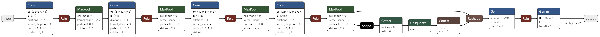
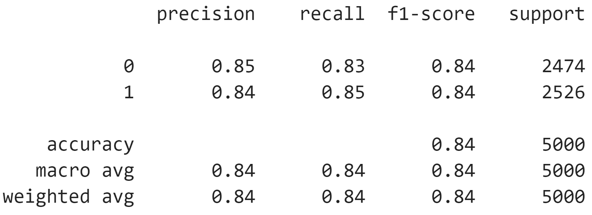

# CatDogNet

[Портфолио](https://jellywilliam.github.io)

[Ссылка на репозиторий](https://github.com/JellyWilliam/CatDogNet)

# Набор данных

[Cats-vs-Dogs](https://www.kaggle.com/datasets/shaunthesheep/microsoft-catsvsdogs-dataset)
представляет собой набор изображений кошек и собак с метками классов

Пример данных:

**Cat**

**Dog**

# Архитектура

Модель представляет собой CNN с 4 слоями свертки, нормализацией, пуллингом, регуляризацией и двумя полносвязными
слоями.

## Веса модели

Вы можете загрузить веса модели по данной [ссылке](https://drive.google.com/file/d/1cRF28Ixjl1BUddxunewmrN11_I5idw7w/view?usp=sharing)

# Метрики

Precision, Recall, F1-score представлены на рисунке ниже

